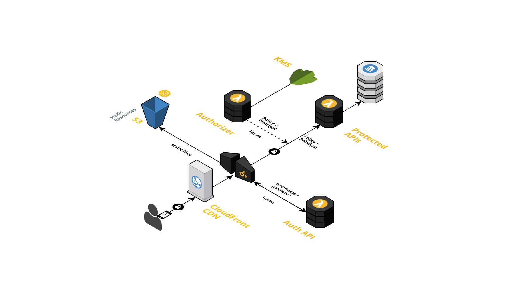
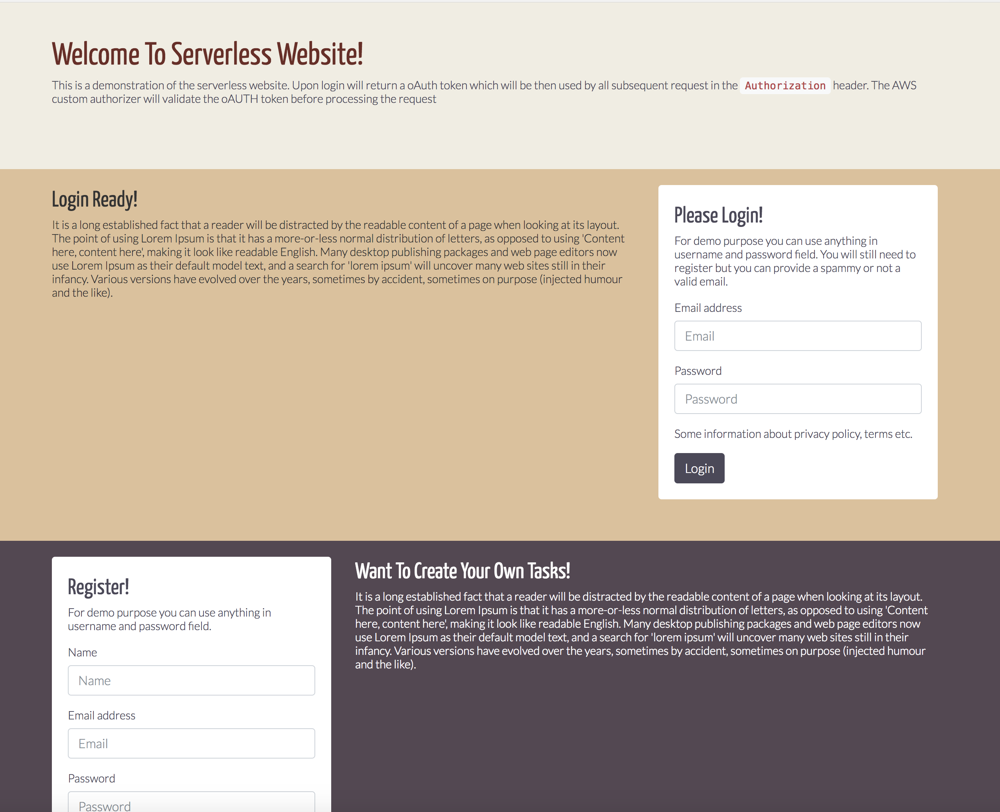

# Go-Serverless-Demo
This is not a utility but a sample project which showcases 3-tier AWS serverless architecture. The three-tier architecture is a popular pattern for user-facing applications. The tiers that comprise this architecture include the presentation tier, the logic tier, and the data tier.

[](https://goreportcard.com/report/github.com/vdparikh/go-serverless-demo)

### Architecture
Below is a quick drawing on the architecture of the project



## Learn More
Read more about this at https://d0.awsstatic.com/whitepapers/AWS_Serverless_Multi-Tier_Architectures.pdf

### The 3 Tiers
- The presentation tier is a set of HTML, CSS, Images and Javascript hosted on S3 and served via API Gateway. You don't need to open up public permissons on S3 as the pages will be served directly via API gateway. 
- The logic tier is set of Lambda functions coded in GO 
    - Login functionality generates a oAuth token for a valid user. Registration API creates the users and stores in DynamoDB. 
    - There is a custom authorizer which then validates all incoming request for the Authorization header/token and allows calling the downstream APIs
    - The downstream APIs perform the actual task and returns the response. 
- Data tier is set of DynamoDB tables which stores user information and tasks (or todos) for the user

All this is packaged and deployed using a single serverless template `serverless.yml` and you read more about serverless at https://serverless.com

### PreRequisites
- You need an AWS account and credentials setup locally. Read more about that at https://github.com/serverless/serverless/blob/master/docs/providers/aws/guide/credentials.md
- You need to have serverless installed `npm install serverless -g`
- Install `serverless-apig-s3` using `npm i -D serverless-apig-s3`. This plugin is used to deploy the UI code to the S3 bucket and create associated endpoints in the gateway. 

### Build and Compile code
This uses the github.com/eawsy/aws-lambda-go-net framework to generates the .so file and the handler.zip which can be leveraged by the serverless template
```
make
```

### Deploy the APIs to the Gateway
You can use anything you want in the stage variable name
```
serverless deploy -v -stage="v1"
```


### Deploy the UI client to S3
The UI code is located in the /app folder and you will need to update the rootURL to match your API gateway endpoint prior to depoloying. 
```
serverless client deploy -v
```


The UI is neatly designed using bootstrap 4.0 and vue.js. It allows login/registration functionality. Upon login it will allow you to create a Task or pull all your tasks. The login generates the oAuth token which is then passed on all subsquent requests. 

### TODO
- Update test cases (I hate doing tests for my weekend projects!)
